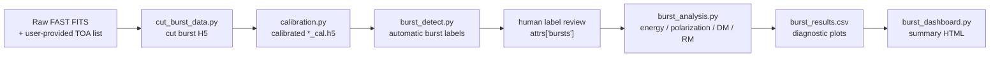

<h1 align="center">AFTER</h1>

<div align="center">

**AI-assisted FAST Transient End-to-end Reduction**

Post-search FAST FRB burst processing from TOA lists to calibrated measurements, result tables, and observation dashboards.

[](https://github.com/SukiYume/AFTER)
[](https://www.python.org/)
[](skills/fast-frb-observation-processing)
[](https://github.com/SukiYume/DRAFTS)

[Overview](#overview) |
[Workflow](#workflow) |
[Installation](#installation) |
[Codex Skill](#codex-skill) |
[Stages](#processing-stages) |
[Chinese](README.zh-CN.md)

</div>

## Overview

**AFTER** is an AI-assisted reduction and analysis workflow for FAST fast radio burst (FRB) observations after a search pipeline has produced candidate burst TOAs. It carries one observation from known source metadata and TOA lists through cutting, calibration, burst-region review, energy and polarization analysis, table export, and dashboard summarization.

AFTER complements search systems such as [DRAFTS](https://github.com/SukiYume/DRAFTS): search pipelines locate transient candidates, while AFTER reduces and characterizes confirmed FAST FRB bursts.

## Highlights

- **TOA-guided cutting** from raw FAST FITS into burst-centered H5 files.
- **Polarization and flux calibration** into Stokes I/Q/U/V products.
- **AI-assisted burst labeling** with human review before physical measurement.
- **Energy and polarization analysis** for TOA, flux, fluence, width, bandwidth, SNR, DM, RM, polarization fractions, PA, and PAV.
- **Self-contained observation dashboards** from `burst_results.csv`, including charts, burst catalog rows, diagnostic-plot embeds, and reliable-RM caveats.
- **Flexible entry points** from raw FITS, cut H5, calibrated H5, or calibrated H5 with existing burst labels.
- **Codex skill support** for agent-driven installation, validation, staged processing, review handoff, and final reporting.

## Workflow



AFTER supports the full sequence:

```text
cut -> calibrate -> detect -> review labels -> analyze energy/polarization -> export table -> build dashboard
```

The workflow can also begin from an intermediate product:

| Starting point | Required inputs | AFTER continues with |
|---|---|---|
| Raw FAST FITS | FITS directory, source, date, beam, DM, user-provided TOA seconds | Cut, calibrate, detect, review labels, analyze, export table |
| Cut H5 | H5 files from `cut_burst_data.py` and matching `_0001.fits` | Calibrate, detect, review labels, analyze, export table |
| Calibrated H5 | `*_cal.h5` with `data`, `freq`, `rfi_mask`, `gain`, `gain_err` | Detect, review labels, analyze, export table |
| Detected calibrated H5 | `*_cal.h5` with H5 attr `bursts` | Verify labels, analyze, export table |

TOA seconds are supplied by the user or an upstream search product. Automatic detection boxes are reviewed before energy and polarization analysis, so the final measurements use accepted burst regions.

## Repository Layout

| Path | Role |
|---|---|
| `cut_burst_data.py` | Cut burst-centered H5 files from raw FAST FITS using TOA, DM, and beam metadata. |
| `calibration.py` | Calibrate cut H5 files into Stokes I/Q/U/V, gain-corrected products with RFI masks. |
| `burst_detect.py` | Run automatic, semi-automatic, or manual burst-region labeling and write H5 `attrs["bursts"]`. |
| `burst_analysis.py` | Measure DM, RM, polarization, flux, fluence, width, bandwidth, and SNR for accepted bursts. |
| `burst_dashboard.py` | Build a self-contained HTML dashboard from `burst_results.csv` and analysis diagnostic plots. |
| `burst_dm.py` | Fine DM search routines used by `burst_analysis.py`. |
| `burst_pol.py` | RM, PA, PAV, and polarization processing routines used by `burst_analysis.py`. |
| `burst_properties.py` | Flux, fluence, width, bandwidth, and SNR measurement routines. |
| `rfi_utils.py` | Shared RFI channel and pixel masking utilities. |
| `ZeithAngle.py` | FAST zenith-angle and gain helpers from MJD, coordinates, and beam. |
| `gain_para.csv` | FAST beam gain parameter table. |
| `highcal_20201014_psr_tny.npz` | Default noise-calibration reference file. |
| `models/` | Burst-region detection model weights. |
| `batch_processing/` | Batch wrappers for cutting, FITS-to-H5 conversion, and calibration. |
| `skills/fast-frb-observation-processing/` | Codex skill for agent-driven AFTER operation. |
| `requirements.txt` | Python dependency list. |

## Installation

Create a Python environment from the repository root:

```bash
git clone https://github.com/SukiYume/AFTER.git
cd AFTER
python -m venv .venv
source .venv/bin/activate
python -m pip install -U pip
python -m pip install -r requirements.txt
```

Windows PowerShell:

```powershell
git clone https://github.com/SukiYume/AFTER.git
cd AFTER
python -m venv .venv
.\.venv\Scripts\Activate.ps1
python -m pip install -U pip
python -m pip install -r requirements.txt
```

For GPU inference, install `torch` and `torchvision` with the PyTorch command that matches the machine's CUDA and driver versions. Record the actual Python, CUDA, PyTorch, and ultralytics versions for production batch runs.

Core packages include `numpy`, `scipy`, `h5py`, `astropy`, `matplotlib`, `pandas`, `seaborn`, `numba`, `opencv-python`, `torch`, `torchvision`, and `ultralytics`.

## Codex Skill

AFTER ships with a Codex skill:

```text
skills/fast-frb-observation-processing/
```

One-line request for a Codex agent:

```text
Please install the Codex skill from this repository: copy skills/fast-frb-observation-processing into the Codex skills directory, set DATA_PROCESSING_ROOT to this AFTER repository root, and run the post-install validation.
```

Manual installation:

```bash
mkdir -p "${CODEX_HOME:-$HOME/.codex}/skills"
cp -R skills/fast-frb-observation-processing "${CODEX_HOME:-$HOME/.codex}/skills/"
export DATA_PROCESSING_ROOT="$(pwd)"
```

Windows PowerShell:

```powershell
$codexHome = if ($env:CODEX_HOME) { $env:CODEX_HOME } else { Join-Path $HOME ".codex" }
New-Item -ItemType Directory -Force (Join-Path $codexHome "skills") | Out-Null
Copy-Item -Recurse -Force .\skills\fast-frb-observation-processing (Join-Path $codexHome "skills")
$env:DATA_PROCESSING_ROOT = (Get-Location).Path
```

Add `DATA_PROCESSING_ROOT` to a shell profile or system environment variable for persistent agent use.

## Validation

Run these checks from the repository root after installing dependencies:

```bash
python -m py_compile cut_burst_data.py calibration.py burst_detect.py burst_analysis.py burst_dashboard.py burst_dm.py burst_pol.py burst_properties.py rfi_utils.py ZeithAngle.py batch_processing/batch_calibration.py batch_processing/batch_cut_burst_data.py batch_processing/batch_cut_selected_long_period.py batch_processing/fits_to_h5.py
python -c "import numpy, scipy, h5py, astropy, matplotlib, pandas, seaborn, numba, torch, torchvision, ultralytics, cv2; print('basic imports OK')"
python burst_detect.py --help
python burst_analysis.py --help
python burst_dashboard.py --help
```

Validate the Codex skill when a skill authoring validator is available:

```bash
python /path/to/quick_validate.py skills/fast-frb-observation-processing
```

## Processing Stages

### 1. Cut raw FITS

`cut_burst_data.py` uses the raw FAST FITS directory, FRB/source name, observation date, beam, DM, and supplied TOA seconds to produce burst-centered H5 files.

Primary outputs:

```text
{frb}-{date}-M{beam:02d}-{fits_number:04d}-{start_sample:09d}.h5
obs_info.json
```

Cut H5 schema:

```text
data: (nsamp, npol, nchan)
freq: (nchan,), MHz
attrs: start_sample, file_mjd, toa_sec, time_reso, npol, nchan,
       segment_length, obs_start_mjd, dm
```

### 2. Calibrate

`calibration.py` converts cut H5 files into calibrated Stokes I/Q/U/V products. It uses the matching `_0001.fits`, RA/DEC, beam metadata, FAST gain parameters, and a noise-calibration file.

Primary outputs:

```text
*_cal.h5
quick-look .jpg
```

Calibrated H5 schema:

```text
data:        (4, nsamp, nchan), Stokes I/Q/U/V, Jy
freq:        (nchan,), MHz
rfi_mask:    (nsamp, nchan), bool
rfi_channel: (nchan,), bool
gain:        (nchan,), K/Jy
gain_err:    (nchan,), K/Jy
```

Common saved-resolution choices:

- `down_time=None`, `down_freq=None`: automatic plot-friendly resolution.
- `down_time=1`: raw time resolution for peak-flux comparison.
- `down_freq=1`: raw frequency channels for detailed RFI or spectral inspection.

### 3. Detect and review burst labels

`burst_detect.py` supports automatic, semi-automatic, and manual burst-region labeling.

Automatic mode:

```bash
python burst_detect.py \
  --mode auto \
  --cal-dir /path/to/calibrated_h5 \
  --model-path models/best_model_yolo11n_ema.pth \
  --model-name yolo11n \
  --output-dir /path/to/detections_auto
```

Detection outputs:

- H5 `attrs["bursts"]`: the label source used by analysis.
- `detections.json`: the resume and review ledger.
- `plots/*_det.png`: review plots with accepted boxes.

The review step checks automatic labels, records files that need correction, and uses semi-automatic or manual mode for corrected regions. An intentionally empty burst page is stored as:

```json
{"bursts": [], "has_burst": false}
```

### 4. Analyze and export

`burst_analysis.py` reads accepted H5 `attrs["bursts"]` and measures each burst.

Example:

```bash
python burst_analysis.py \
  --cal-dir /path/to/calibrated_h5 \
  --output-dir /path/to/analysis_output \
  --dm-range 5 \
  --dm-step 0.1 \
  --rm-min -1000 \
  --rm-max 1000 \
  --n-rm 100000
```

Measured quantities include TOA, peak flux, fluence, width, burst bandwidth, SNR, DM, RM, linear polarization, circular polarization, total polarization, PA, and PAV.

Primary outputs:

```text
burst_results.csv
DM/RM/polarization diagnostic plots
```

### 5. Build dashboard

`burst_dashboard.py` reads `burst_results.csv` and produces a self-contained HTML summary that can be opened directly in a browser or printed to PDF.

Example:

```bash
python burst_dashboard.py \
  --csv /path/to/analysis/burst_results.csv \
  --output /path/to/analysis/burst_dashboard.html \
  --analysis-dir /path/to/analysis \
  --source FRBNAME \
  --date YYYYMMDD \
  --reference-dm 539 \
  --rm-significance-threshold 5 \
  --top-n 10
```

Dashboard summary metrics include burst count, time span, event rate, peak S/N, DM range, width range, reliable-RM count, and `FLUENCE x BW = sum(fluence * bandwidth_GHz)` in `Jy ms GHz`. This is the observation-side fluence-bandwidth term only; it is not isotropic energy, received energy, or a luminosity-distance/redshift calculation.

Primary output:

```text
burst_dashboard.html
```

## Batch Catalogs

Batch input tables are passed explicitly to the batch wrappers. Local observation catalogs under `batch_processing/*.txt` are ignored by git, while public templates can use `*.example.txt`.

`FRB*_Burst.txt`:

```text
base project name date beam dm time
```

`h5_calibration_dm_file.txt`:

```text
FRB_name DM RA DEC
```

## Output Policy

AFTER keeps generated data products outside version control by default:

- H5/FITS data: `*.h5`, `*.fits`, `*_cal.h5`
- Diagnostic images and dashboard exports: `*.jpg`, `*.png`, `burst_dashboard.html`
- Detection and analysis outputs: `detections/`, `analysis_output/`, `analysis_outputs/`
- Local batch inputs: `batch_processing/*.txt`
- Retired model checkpoints: `models/*.old`

## Related Project

[DRAFTS](https://github.com/SukiYume/DRAFTS) is a deep learning-based radio fast transient search pipeline. AFTER continues the scientific workflow after search by reducing and characterizing confirmed FAST FRB bursts.

---

<div align="center">
  <sub>AFTER turns confirmed FAST FRB candidates into calibrated measurements and reviewable result tables.</sub>
</div>
