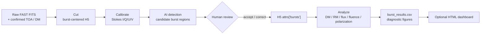

<h1 align="center">AFTER</h1>

<div align="center">

**AI-assisted FAST Transient End-to-end Reduction**

From confirmed burst TOAs to calibrated, reviewable FAST FRB measurements

[](https://github.com/SukiYume/AFTER)
[](https://github.com/SukiYume/AFTER/stargazers)
[](https://www.python.org/)
[](skills/fast-frb-observation-processing)
[](https://github.com/SukiYume/DRAFTS)

[Overview](#overview) ·
[Workflow](#after-workflow) ·
[Installation](#installation) ·
[Quick start](#quick-start) ·
[Data contracts](#data-contracts) ·
[Codex skill](#codex-skill) ·
[简体中文](README.zh-CN.md)

</div>

---

## Overview

**AFTER** is an **AI-assisted FAST Transient End-to-end Reduction** workflow
for post-search processing of FAST fast radio burst (FRB) observations. An
upstream search pipeline or an observer supplies confirmed candidate TOAs and
basic observation metadata; AFTER turns them into calibrated H5 products,
reviewed burst regions, physical measurements, diagnostic figures, result
tables, and an optional HTML observation dashboard.

AFTER covers the scientific workflow after candidate discovery:

1. cut burst-centered data from raw FAST FITS;
2. calibrate flux and polarization into Stokes I/Q/U/V;
3. detect burst regions with an AI model;
4. review or correct the proposed labels;
5. measure TOA, DM, RM, flux, fluence, width, bandwidth, SNR, and polarization;
6. export reviewable tables, plots, and dashboards.

AFTER complements search systems such as
[DRAFTS](https://github.com/SukiYume/DRAFTS). DRAFTS finds transient
candidates; AFTER reduces and characterizes the confirmed FAST bursts.

### Why AFTER

- **End-to-end post-search reduction** from TOA lists to science-ready tables;
- **Flexible entry points** from raw FITS, cut H5, calibrated H5, or labeled H5;
- **Flux and polarization calibration** with FAST beam gain and noise-cal data;
- **AI-assisted, human-verified labels** before physical measurements;
- **Reproducible data contracts** for cut, calibrated, detected, and analyzed products;
- **Batch and interactive operation** for large observing campaigns and individual review;
- **Codex skill support** for agent-guided setup, validation, staged execution, and handoff.

## AFTER workflow



The pipeline is deliberately resumable. Start from the earliest product
available:

| Starting point | Required input | AFTER continues with |
|---|---|---|
| Raw FAST FITS | FITS directory, source, date, beam, DM, confirmed TOA seconds | Cut, calibrate, detect, review, analyze, export |
| Cut H5 | `.h5` files, matching `_0001.fits`, RA/DEC, calibration reference | Calibrate, detect, review, analyze, export |
| Calibrated H5 | `*_cal.h5`, detector model, output directory | Detect, review, analyze, export |
| Labeled calibrated H5 | `*_cal.h5` with H5 attr `bursts` | Verify labels, analyze, export, dashboard |
| Analysis table | `burst_results.csv` and optional diagnostic directory | Build or refresh the dashboard |

### Two scientific guardrails

1. **AFTER does not infer TOAs from filenames or quick-look images.** TOA
   seconds must come from the observer or an upstream search product.
2. **Automatic boxes are proposals, not final measurements.** Review accepted
   burst regions before running energy and polarization analysis.

## Repository layout

| Path | Role in AFTER |
|---|---|
| [`cut_burst_data.py`](cut_burst_data.py) | Cut burst-centered H5 files from raw FAST FITS using TOA, DM, and beam metadata. |
| [`calibration.py`](calibration.py) | Perform flux/polarization calibration, downsampling, RFI masking, and calibrated H5 export. |
| [`calibration_noise.py`](calibration_noise.py) | Noise-diode calibration helpers and related calculations. |
| [`burst_detect.py`](burst_detect.py) | Automatic, semi-automatic, or manual burst-region labeling; writes H5 `attrs["bursts"]`. |
| [`burst_analysis.py`](burst_analysis.py) | Measure DM, RM, polarization, flux, fluence, width, bandwidth, and SNR. |
| [`burst_dashboard.py`](burst_dashboard.py) | Build a self-contained HTML observation dashboard from `burst_results.csv`. |
| [`burst_dm.py`](burst_dm.py) | Fine-DM search routines used by the analysis stage. |
| [`burst_pol.py`](burst_pol.py) | RM, PA, PAV, and polarization utilities. |
| [`burst_properties.py`](burst_properties.py) | Flux, fluence, width, bandwidth, and SNR utilities. |
| [`rfi_utils.py`](rfi_utils.py) | Shared RFI channel and pixel masking utilities. |
| [`ZeithAngle.py`](ZeithAngle.py) | FAST zenith-angle and beam-gain helpers. |
| [`gain_para.csv`](gain_para.csv) | FAST beam gain parameters. |
| [`highcal_20201014_psr_tny.npz`](highcal_20201014_psr_tny.npz) | Default noise-calibration reference. |
| [`models/`](models/) | Production burst-region detector and local experimental checkpoints. |
| [`batch_processing/`](batch_processing/) | Batch cutting, selected long-period cutting, legacy FITS conversion, and calibration wrappers. |
| [`skills/fast-frb-observation-processing/`](skills/fast-frb-observation-processing/) | Codex operating protocol for AFTER. |
| [`requirements.txt`](requirements.txt) | Python dependencies. |

## Installation

Linux/macOS:

```bash
git clone https://github.com/SukiYume/AFTER.git
cd AFTER
python -m venv .venv
source .venv/bin/activate
python -m pip install -U pip
python -m pip install -r requirements.txt
```

Windows PowerShell:

```powershell
git clone https://github.com/SukiYume/AFTER.git
cd AFTER
python -m venv .venv
.\.venv\Scripts\Activate.ps1
python -m pip install -U pip
python -m pip install -r requirements.txt
```

Install `torch` and `torchvision` with builds matching the target CUDA driver
when GPU detection is required. For production runs, record the Python, CUDA,
PyTorch, torchvision, and ultralytics versions with the output.

Core dependencies include NumPy, SciPy, h5py, Astropy, Matplotlib, pandas,
Seaborn, Numba, OpenCV, PyTorch, torchvision, and Ultralytics.

### Validate the installation

```bash
python -m compileall -q .
python burst_detect.py --help
python burst_analysis.py --help
python burst_dashboard.py --help
python -m unittest \
  test_burst_dashboard.py \
  test_burst_detect_filters.py \
  test_calibration_noise.py \
  test_rm_reanalysis.py
```

## Quick start

The examples below use generic paths. Replace `/path/to/...` with locations on
your own workstation or compute node.

### 1. Cut raw FAST FITS

Batch entry point:

```bash
python batch_processing/batch_cut_burst_data.py \
  --burst-txt /path/to/catalogs/FRBXXXX_Burst.txt \
  --output-root /path/to/after_runs/cut/FRBXXXX \
  --save-frb-name FRBXXXX \
  --segment-length 65536 \
  --workers 8
```

`FRBXXXX_Burst.txt` uses:

```text
base project name date beam dm time
```

The wrapper groups events by raw-data path, date, beam, and DM; copies the first
matching beam FITS needed for calibration; cuts every supplied TOA; and writes
`obs_info.json`.

For selected long-period candidates with row-specific segment lengths:

```bash
python batch_processing/batch_cut_selected_long_period.py \
  --plan-txt /path/to/catalogs/Selected_LongPeriod_Burst.txt \
  --output-root /path/to/after_runs/long_period_cut \
  --workers 8
```

### 2. Convert legacy burst FITS

Use the compatibility converter when older burst cuts need the current H5
schema:

```bash
python batch_processing/fits_to_h5.py \
  --asd-root /path/to/legacy_burst_data \
  --output-root /path/to/after_runs/cut \
  --catalog-dir /path/to/catalogs
```

It copies matching `_0001.fits` calibration files and writes H5 products
compatible with `cut_burst_data.py`.

### 3. Calibrate

```bash
python batch_processing/batch_calibration.py \
  --root-dir /path/to/after_runs/cut \
  --cal-root /path/to/after_runs/calibrated \
  --dm-file /path/to/catalogs/h5_calibration_dm_file.txt \
  --cal-npz highcal_20201014_psr_tny.npz \
  --workers 8
```

Calibration catalog format:

```text
FRB_name DM RA DEC
```

Useful saved-resolution choices:

- omit `--down-time` and `--down-freq` for automatic, plot-friendly resolution;
- use `--down-time 1` to preserve raw time resolution for peak-flux comparisons;
- use `--down-freq 1` to preserve raw frequency channels for detailed spectral
  and RFI inspection.

### 4. Detect and review burst regions

Automatic mode:

```bash
python burst_detect.py \
  --mode auto \
  --cal-dir /path/to/after_runs/calibrated \
  --model-path models/best_model_yolo11n_ema.pth \
  --model-name yolo11n \
  --output-dir /path/to/after_runs/detections
```

Detection writes:

- H5 `attrs["bursts"]`, the label source used by analysis;
- `detections.json`, the resume and review ledger;
- `plots/*_det.png`, review images with the accepted regions.

Automatic and semi-automatic modes infer once from calibrated Stokes I. After
regions are confirmed, AFTER recomputes the analysis-style Stokes-I/V RFI union
from non-burst samples, writes the `burst_rfi_*` products, and saves the final
masked residual plot.

After confidence filtering, overly horizontal boxes are removed using
`--max-horizontal-aspect` (default `3`). Positive-area overlaps are reduced to
the largest region before NMS.

Use `--mode semi-auto` to revisit selected entries from `detections.json`, or
`--mode manual` when model suggestions are not useful. In the interactive
review UI, `x` records an intentionally empty burst list; `q` or `Esc` saves
completed progress and exits without marking the current file complete.

### 5. Analyze physical properties

```bash
python burst_analysis.py \
  --cal-dir /path/to/after_runs/calibrated \
  --output-dir /path/to/after_runs/analysis \
  --dm-range 5 \
  --dm-step 0.1 \
  --rm-min -1000 \
  --rm-max 1000 \
  --n-rm 100000
```

Measured quantities include TOA, peak flux, fluence, width, burst bandwidth,
SNR, DM, RM, linear/circular/total polarization, PA, and PAV. Write reruns with
different DM/RM ranges to separate output directories.

Primary outputs:

```text
burst_results.csv
DM / RM / polarization diagnostic figures
```

### 6. Build the observation dashboard

```bash
python burst_dashboard.py \
  --csv /path/to/after_runs/analysis/burst_results.csv \
  --output /path/to/after_runs/analysis/burst_dashboard.html \
  --analysis-dir /path/to/after_runs/analysis \
  --source FRBNAME \
  --date YYYYMMDD \
  --reference-dm 539 \
  --rm-significance-threshold 5 \
  --top-n 10
```

The dashboard is a self-contained HTML report that can be opened locally or
printed to PDF.

## Data contracts

### Cut H5

```text
data: (nsamp, npol, nchan)
freq: (nchan,), MHz
attrs: start_sample, file_mjd, toa_sec, time_reso, npol, nchan,
       segment_length, obs_start_mjd, dm
```

### Calibrated H5

```text
data:        (4, nsamp, nchan), Stokes I/Q/U/V, Jy
freq:        (nchan,), MHz
rfi_mask:    (nsamp, nchan), bool
rfi_channel: (nchan,), bool
gain:        (nchan,), K/Jy
gain_err:    (nchan,), K/Jy
attrs: time_reso_raw, time_reso, down_time, down_freq,
       dm, beam, ra, dec
```

### Accepted burst region

```json
{
  "time_start": 120,
  "time_end": 180,
  "freq_start": 40,
  "freq_end": 500,
  "confidence": 0.82
}
```

An intentionally rejected page is represented by an empty burst list rather
than a missing review record.

## Codex skill

AFTER includes a Codex skill at:

```text
skills/fast-frb-observation-processing/
```

You can ask Codex:

```text
Install the Codex skill from this AFTER repository, set DATA_PROCESSING_ROOT
to the repository root, and run the post-install validation.
```

Manual Bash installation:

```bash
mkdir -p "${CODEX_HOME:-$HOME/.codex}/skills"
cp -R skills/fast-frb-observation-processing \
  "${CODEX_HOME:-$HOME/.codex}/skills/"
export DATA_PROCESSING_ROOT="$(pwd)"
```

Windows PowerShell:

```powershell
$codexRoot = if ($env:CODEX_HOME) {
    $env:CODEX_HOME
} else {
    Join-Path $HOME ".codex"
}
New-Item -ItemType Directory -Force (Join-Path $codexRoot "skills") | Out-Null
Copy-Item -Recurse -Force `
  .\skills\fast-frb-observation-processing `
  (Join-Path $codexRoot "skills")
$env:DATA_PROCESSING_ROOT = (Get-Location).Path
```

Persist `DATA_PROCESSING_ROOT` in the relevant shell profile or environment
configuration if agents should find AFTER in later sessions.

## Repository and output policy

The repository tracks processing code, tests, documentation, the current
production detector, and the compact calibration/gain assets required by the
documented defaults.

Generated products stay outside version control:

- raw and cut data: `*.fits`, `*.h5`, `*_cal.h5`;
- review and diagnostic images: `*.jpg`, `*.png`;
- detection and analysis directories;
- local observation catalogs under `batch_processing/*.txt`;
- retired and experimental model checkpoints.

The tracked production detector is
`models/best_model_yolo11n_ema.pth`. Keep each new run in a dedicated output
directory so relabeling, parameter sweeps, and dashboard refreshes do not
silently overwrite earlier results.

## DRAFTS and AFTER

```text
DRAFTS: transient search and candidate selection
    -> confirmed source / date / beam / TOA / DM
AFTER: cut, calibrate, review, measure, and report
```

Use [DRAFTS](https://github.com/SukiYume/DRAFTS) when the task is to find
candidates in observation data. Use AFTER after the candidate list is known
and the goal is calibrated physical characterization.

---

<div align="center">
  <sub>AFTER · From confirmed FAST transients to calibrated measurements</sub>
</div>
