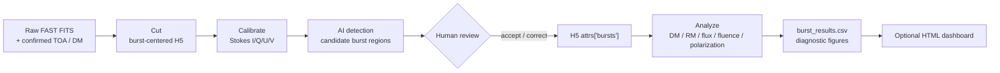

<h1 align="center">AFTER</h1>

<div align="center">

**AI-assisted FAST Transient End-to-end Reduction**

From confirmed burst TOAs to calibrated, reviewable FAST FRB measurements

[](https://github.com/SukiYume/AFTER)
[](https://github.com/SukiYume/AFTER)
[](https://www.python.org/)
[](LICENSE)
[](skills/fast-frb-observation-processing/SKILL.md)
[](https://github.com/SukiYume/DRAFTS)

[Overview](#overview) ·
[Workflow](#after-workflow) ·
[Installation](#installation) ·
[Agent setup](#agent-one-prompt-setup) ·
[Quick start](#quick-start) ·
[Data contracts](#data-contracts) ·
[简体中文](README.zh-CN.md)

</div>

---

## Overview

**AFTER** is an **AI-assisted FAST Transient End-to-end Reduction** workflow
for post-search processing of FAST fast radio burst (FRB) observations. An
upstream search pipeline or an observer supplies confirmed candidate TOAs and
basic observation metadata; AFTER turns them into calibrated H5 products,
reviewed burst regions, physical measurements, diagnostic figures, result
tables, and an optional HTML observation dashboard.

AFTER covers the scientific workflow after candidate discovery:

1. cut burst-centered data from raw FAST FITS;
2. calibrate flux and polarization into Stokes I/Q/U/V;
3. detect burst regions with an AI model;
4. review or correct the proposed labels;
5. measure TOA, DM, RM, flux, fluence, width, bandwidth, SNR, and polarization;
6. export reviewable tables, plots, and dashboards.

AFTER complements search systems such as DRAFTS. DRAFTS finds transient
candidates; AFTER reduces and characterizes the confirmed FAST bursts.

### Why AFTER

- **End-to-end post-search reduction** from TOA lists to science-ready tables;
- **Flexible entry points** from raw FITS, cut H5, calibrated H5, or labeled H5;
- **Flux and polarization calibration** with FAST beam gain and noise-cal data;
- **AI-assisted, human-verified labels** before physical measurements;
- **Reproducible data contracts** for cut, calibrated, detected, and analyzed products;
- **Batch and interactive operation** for large observing campaigns and individual review;
- **Codex skill support** for agent-guided setup, validation, staged execution, and handoff.

## AFTER workflow


```mermaid
flowchart LR
    A["Raw FAST FITS<br/>+ confirmed TOA / DM"] --> B["Cut<br/>burst-centered H5"]
    B --> C["Calibrate<br/>Stokes I/Q/U/V"]
    C --> D["AI detection<br/>candidate burst regions"]
    D --> E{"Human review"}
    E -->|"accept / correct"| F["H5 attrs['bursts']"]
    F --> G["Analyze<br/>DM / RM / flux / fluence / polarization"]
    G --> H["burst_results.csv<br/>diagnostic figures"]
    H --> I["Optional HTML dashboard"]
```

The pipeline is deliberately resumable. Start from the earliest product
available:

| Starting point | Required input | AFTER continues with |
|---|---|---|
| Raw FAST FITS | FITS directory, source, date, beam, DM, confirmed TOA seconds | Cut, calibrate, detect, review, analyze, export |
| Cut H5 | `.h5` files, matching `_0001.fits`, RA/DEC, calibration reference | Calibrate, detect, review, analyze, export |
| Calibrated H5 | `*_cal.h5`, detector model, output directory | Detect, review, analyze, export |
| Labeled calibrated H5 | `*_cal.h5` with H5 attr `bursts` | Verify labels, analyze, export, dashboard |
| Analysis table | `burst_results.csv` and optional diagnostic directory | Build or refresh the dashboard |

### Two scientific guardrails

1. **Use observer-confirmed or upstream-search TOA seconds.** They define every
   burst cut.
2. **Review automatic burst boxes before measurement.** Analysis uses the
   accepted regions stored in H5.

## Repository layout

| Path | Role in AFTER |
|---|---|
| [`after/`](after/) | Importable single-observation package. Run its entry points from the repository root as `python -m after.<module>`. |
| [`calibration.py`](calibration.py) and [`cut_burst_data.py`](cut_burst_data.py) | Root launchers for the direct `python calibration.py` and `python cut_burst_data.py` commands. |
| [`after/cut_burst_data.py`](after/cut_burst_data.py) | Cut burst-centered H5 files from raw FAST FITS using TOA, DM, and beam metadata. |
| [`after/calibration.py`](after/calibration.py) and [`after/calibration_noise.py`](after/calibration_noise.py) | Flux/polarization and noise-diode calibration, downsampling, RFI masking, and calibrated H5 export. |
| [`after/burst_detect.py`](after/burst_detect.py) | Automatic, semi-automatic, or manual burst-region labeling; writes H5 `attrs["bursts"]`. |
| [`after/burst_analysis.py`](after/burst_analysis.py) | Measure DM, RM, polarization, flux, fluence, width, bandwidth, and SNR. |
| [`after/burst_sync_rm.py`](after/burst_sync_rm.py) | Search a common RM by combining multiple labeled calibrated H5 burst components. |
| [`after/burst_dashboard.py`](after/burst_dashboard.py) | Build a single-file HTML observation dashboard from `burst_results.csv`; Google Fonts load when network access is available. |
| [`after/burst_dm.py`](after/burst_dm.py), [`after/burst_pol.py`](after/burst_pol.py), and [`after/burst_properties.py`](after/burst_properties.py) | Scientific measurement modules used by the analysis stage. |
| [`after/rfi.py`](after/rfi.py), [`after/obs_metadata.py`](after/obs_metadata.py), and [`after/zenith_angle.py`](after/zenith_angle.py) | Shared RFI, observation-metadata, and FAST beam-gain helpers. |
| [`gain_para.csv`](gain_para.csv) | FAST beam gain parameters. |
| [`highcal_20201014_psr_tny.npz`](highcal_20201014_psr_tny.npz) | Default noise-calibration reference. |
| [`models/`](models/) | Current production burst-region detector checkpoint. |
| [`training/`](training/README.md) | Training, validation, and preview code for the production burst detector. |
| [`batch_processing/`](batch_processing/README.md) | Batch cutting, selected long-period cutting, legacy FITS conversion, and calibration wrappers. |
| [`tests/`](tests/) | Regression tests for calibration, detection, RM analysis, and dashboard generation. |
| [`skills/fast-frb-observation-processing/`](skills/fast-frb-observation-processing/) | Codex operating protocol for AFTER. |
| [`requirements.txt`](requirements.txt) | Python dependencies. |
| [`requirements-training.txt`](requirements-training.txt) | Additional dependencies for detector training. |

Bundled runtime assets are resolved from
[`after/__init__.py`](after/__init__.py) relative to the repository, keeping
asset lookup independent of the caller's working directory.

The two root launchers delegate to the package. Configure single-observation
constants in `after/calibration.py` or `after/cut_burst_data.py`, then use the
root command or the equivalent `python -m after.<module>` command.

## Installation

### Prerequisites

Install these before cloning AFTER:

- [Git](https://git-scm.com/downloads);
- a 64-bit [Python](https://www.python.org/downloads/) 3.10 or newer with
  `venv` and `pip`;
- internet access to GitHub and the Python package index during installation.

CPU execution is supported. A compatible GPU build of PyTorch is optional and
only needed for accelerated detection. Verify the commands available on the
new system before continuing:

```text
git --version
python3 --version    # Linux/macOS
python --version     # Windows
```

Linux/macOS:

```bash
git clone https://github.com/SukiYume/AFTER.git AFTER
cd AFTER
python3 -m venv .venv
source .venv/bin/activate
python -m pip install -U pip
```

Windows PowerShell:

```powershell
git clone https://github.com/SukiYume/AFTER.git AFTER
cd AFTER
python -m venv .venv
.\.venv\Scripts\Activate.ps1
python -m pip install -U pip
```

For CPU use, install all dependencies directly:

```bash
python -m pip install -r requirements.txt
```

For NVIDIA CUDA or AMD ROCm acceleration, first run the `torch` and
`torchvision` command generated by the official
[PyTorch installer](https://pytorch.org/get-started/locally/) for the operating
system and compute platform, then run the same requirements command. The
unversioned `torch` entries in `requirements.txt` preserve that selected build.

The complete Git clone already contains the default detector checkpoint,
noise-calibration reference, and beam-gain table; Git LFS and separate model
downloads are not required.

### Validate the installation

```bash
python -c "import numpy, scipy, h5py, astropy, matplotlib, pandas, seaborn, numba, cv2, torch, torchvision, ultralytics; print('dependency imports OK')"
python -c "import torch; device = 'cuda' if torch.cuda.is_available() else 'cpu'; print(f'torch={torch.__version__}, device={device}'); print(torch.rand(1, device=device))"
python -c "from after import DEFAULT_GAIN_CSV, DEFAULT_CAL_NPZ, DEFAULT_DETECTOR_MODEL; paths = (DEFAULT_GAIN_CSV, DEFAULT_CAL_NPZ, DEFAULT_DETECTOR_MODEL); assert all(p.is_file() for p in paths), paths; print('runtime assets OK')"
python -m compileall -q after batch_processing tests calibration.py cut_burst_data.py
python -c "from calibration import process_one_burst; from cut_burst_data import cut_one_burst; print('compatibility imports OK')"
python batch_processing/batch_cut_burst_data.py --help
python batch_processing/batch_cut_selected_long_period.py --help
python batch_processing/fits_to_h5.py --help
python batch_processing/batch_calibration.py --help
python -m after.burst_detect --help
python -m after.burst_analysis --help
python -m after.burst_sync_rm --help
python -m after.burst_dashboard --help
python -m pytest -q
```

## Agent one-prompt setup

AFTER ships with an operating skill for Codex and other repository-aware
coding agents. Copy the following single instruction into the agent:

```text
Install AFTER from https://github.com/SukiYume/AFTER.git for a first-time user. After cloning, follow the README “Installation” and “Validate the installation” sections, install the bundled fast-frb-observation-processing skill, persist DATA_PROCESSING_ROOT as the absolute repository root, and report every validation result before processing observation data.
```

For Codex, the bundled skill lives at:

```text
skills/fast-frb-observation-processing/
```

Manual Bash installation:

```bash
mkdir -p "${CODEX_HOME:-$HOME/.codex}/skills"
cp -R skills/fast-frb-observation-processing \
  "${CODEX_HOME:-$HOME/.codex}/skills/"
export DATA_PROCESSING_ROOT="$(pwd -P)"
test -f "${CODEX_HOME:-$HOME/.codex}/skills/fast-frb-observation-processing/SKILL.md"
test -f "${CODEX_HOME:-$HOME/.codex}/skills/fast-frb-observation-processing/agents/openai.yaml"
```

Windows PowerShell:

```powershell
$codexRoot = if ($env:CODEX_HOME) {
    $env:CODEX_HOME
} else {
    Join-Path $HOME ".codex"
}
New-Item -ItemType Directory -Force (Join-Path $codexRoot "skills") | Out-Null
Copy-Item -Recurse -Force `
  .\skills\fast-frb-observation-processing `
  (Join-Path $codexRoot "skills")
$afterRepoRoot = (Get-Location).Path
$env:DATA_PROCESSING_ROOT = $afterRepoRoot
[Environment]::SetEnvironmentVariable("DATA_PROCESSING_ROOT", $afterRepoRoot, "User")
Test-Path (Join-Path $codexRoot "skills\fast-frb-observation-processing\SKILL.md")
Test-Path (Join-Path $codexRoot "skills\fast-frb-observation-processing\agents\openai.yaml")
```

On Bash, add `export DATA_PROCESSING_ROOT="/absolute/path/to/AFTER"` to the
shell profile to preserve it for later sessions. This variable helps the agent
locate the checkout; AFTER itself resolves bundled assets from its source
location.

Start a new Codex task after copying the folder so the installed skill is
discovered automatically. In the installation task, the agent should read the
copied `SKILL.md` directly and complete validation. Restart the Codex app or
CLI before relying on a newly persisted `DATA_PROCESSING_ROOT` inherited from
the operating system.

## Quick start

Run every command below from the repository root. The examples use generic
paths; replace `/path/to/...` with locations on your own workstation or compute
node.

The four batch wrappers, their input-table schemas, output layouts, and rerun
options are documented together in
[`batch_processing/README.md`](batch_processing/README.md).

### 1. Cut raw FAST FITS

For a constant-configured single observation, edit the configuration block at
the bottom of `after/cut_burst_data.py`, then run:

```bash
python cut_burst_data.py
```

Batch entry point:

```bash
python batch_processing/batch_cut_burst_data.py \
  --burst-txt /path/to/catalogs/FRBXXXX_Burst.txt \
  --output-root /path/to/after_runs/cut/FRBXXXX \
  --save-frb-name FRBXXXX \
  --segment-length 65536 \
  --workers 8
```

Start from [`batch_processing/Burst.example.txt`](batch_processing/Burst.example.txt)
or create a whitespace-separated table with this header:

```text
base project name date beam dm time
```

The wrapper groups events by raw-data path, date, beam, and DM; copies the first
matching beam FITS needed for calibration; cuts every supplied TOA; and writes
`obs_info.json`. If one date directory contains mixed beam, DM, or segment
length values, the top-level field is a list and each burst entry retains its
own values.

For selected long-period candidates with row-specific segment lengths:

```bash
python batch_processing/batch_cut_selected_long_period.py \
  --plan-txt /path/to/catalogs/Selected_LongPeriod_Burst.txt \
  --output-root /path/to/after_runs/long_period_cut \
  --workers 8
```

### 2. Convert legacy burst FITS

Use the compatibility converter when older burst cuts need the current H5
schema:

```bash
python batch_processing/fits_to_h5.py \
  --asd-root /path/to/legacy_burst_data \
  --output-root /path/to/after_runs/cut \
  --catalog-dir /path/to/catalogs
```

It copies matching `_0001.fits` calibration files and writes H5 products
compatible with `after.cut_burst_data`.

### 3. Calibrate

For a constant-configured single observation, edit `BURST_DIR`, `OUTPUT_DIR`,
RA/DEC, resolution, and worker settings at the bottom of
`after/calibration.py`, then run:

```bash
python calibration.py
```

The default `CAL_NPZ` already points to the repository-root
`highcal_20201014_psr_tny.npz`.

```bash
python batch_processing/batch_calibration.py \
  --root-dir /path/to/after_runs/cut \
  --cal-root /path/to/after_runs/calibrated \
  --dm-file /path/to/catalogs/h5_calibration_dm_file.txt \
  --cal-npz highcal_20201014_psr_tny.npz \
  --workers 8
```

Calibration catalog format:

```text
FRB_name DM RA DEC
```

Useful saved-resolution choices:

- omit `--down-time` and `--down-freq` for automatic, plot-friendly resolution;
- use `--down-time 1` to preserve raw time resolution for peak-flux comparisons;
- use `--down-freq 1` to preserve raw frequency channels for detailed spectral
  and RFI inspection.
- use `--target-time-reso-ms 0.786432 --output-time-samples 512` to calibrate
  the complete input, downsample each file to the same effective time
  resolution, and then center-crop the saved data to 512 samples.

Each burst beam uses its matching `Mxx..._0001.fits`; calibration stops that
beam group when the file is absent. For split directories from the same date,
an unusable noise-calibration file may fall back to a valid same-beam file from
another segment of that date, but never from another date.
FFT RFI detection is the batch default. Pass `--no-rfi-fft` to select entropy
mode. Outputs are written below `<cal-root>/<FRB>/<date>/`.

### 4. Detect and review burst regions

Semi-automatic mode is the default:

```bash
python -m after.burst_detect \
  --cal-dir /path/to/after_runs/calibrated \
  --model-path models/best_model_yolo11n_ema.pth \
  --model-name yolo11n
```

Detection writes:

- H5 `attrs["bursts"]`, the label source used by analysis;
- `<cal-dir>/detections/detections.json` by default, the resume and review
  ledger keyed by paths relative to `--cal-dir`;
- `plots/*_det.png`, review images with the accepted regions.

Pass `--mode auto` for non-interactive detection. `--output-dir` overrides the
default `<cal-dir>/detections` directory.

Automatic and semi-automatic modes infer once from calibrated Stokes I. After
regions are confirmed, AFTER recomputes the analysis-style Stokes-I/V RFI union
from non-burst samples, writes the `burst_rfi_*` products, and saves the final
masked residual plot.

After confidence filtering, overly horizontal boxes are removed using
`--max-horizontal-aspect` (default `3`). Positive-area overlaps are reduced to
the largest region.

Use `--mode semi-auto` to revisit selected entries from `detections.json`, or
`--mode manual` when model suggestions are not useful. In the interactive
review UI, `x` records an intentionally empty burst list; `q` or `Esc` saves
completed progress and exits without marking the current file complete.
When a matching quicklook JPG is present beside the calibrated H5 (for example,
`name_cal.h5` with `name.jpg`), the interactive window shows it read-only on the
right for comparison. Missing JPGs retain the original two-panel layout.

### 5. Analyze physical properties

```bash
python -m after.burst_analysis \
  --cal-dir /path/to/after_runs/calibrated \
  --dm-range 5 \
  --dm-step 0.1 \
  --rm-min -1000 \
  --rm-max 1000 \
  --seed 42
```

Measured quantities include TOA, peak flux, fluence, width, burst bandwidth,
SNR, DM, RM, linear/circular/total polarization, PA, and PAV. The bootstrap
seed and sample count are stored in each CSV row. Write reruns with different
DM/RM ranges to separate output directories. `--cal-dir` is scanned
recursively, so it can point directly at the `<cal-root>` produced by batch
calibration. Analysis writes to `<cal-dir>/analysis` by default;
`--output-dir` overrides that location.

Primary outputs:

```text
burst_results.csv
DM / RM / polarization diagnostic figures
```

To search a common RM directly from multiple labeled calibrated H5 files:

```bash
python -m after.burst_sync_rm \
  --cal-dir /path/to/after_runs/calibrated_df1 \
  --output-dir /path/to/after_runs/joint_rm \
  --rm-min -50000 \
  --rm-max 50000 \
  --test-window full:-50000:50000 \
  --test-window expected:30000:40000 \
  --n-null 1000
```

`after.burst_sync_rm` reports both the primary per-time-sample PA-independent
power sum (`time_pa_power`) and a fixed-weight stack of standardized per-burst
RM-versus-linear-degree curves (`linear_degree_stack`). It reads
`attrs["bursts"]` and uses the union of channel-level RFI masks. It never
applies a time-frequency pixel mask. Samples above the absolute
`--min-time-snr` floor are ranked jointly across every burst using Stokes I
alone; the retained prefix maximizes
`sum(I_sample_S/N**2) / sqrt(n_selected)` without inspecting Q, U, or the RM
curves. `time_sample_selection.csv` records every candidate and
`leave_one_burst_out.csv` reports component influence. The off-pulse trials use
the same selected time-sample counts and channel masks to include the
look-elsewhere effect within each declared test window.
The synchronization and stacking unit is a selected time sample, not an input
burst. The optimized prefix may therefore draw from several bursts or entirely
from one exceptionally bright burst; both are valid. Status names containing
`both_methods` mean that the two retained RM statistics agree, not that two
separate bursts were required to contribute.
Both analysis paths derive the RM spacing automatically from the narrowest
RMSF implied by the selected effective lambda-squared coverage; users specify
only `--rm-min` and `--rm-max`.

### 6. Build the observation dashboard

```bash
python -m after.burst_dashboard \
  --csv /path/to/after_runs/analysis/burst_results.csv \
  --output /path/to/after_runs/analysis/burst_dashboard.html \
  --analysis-dir /path/to/after_runs/analysis \
  --source FRBNAME \
  --date YYYYMMDD \
  --reference-dm 539 \
  --rm-significance-threshold 5 \
  --top-n 10
```

The dashboard is a single HTML file that can be opened locally or printed to
PDF. Figures are embedded; Google Fonts load online with local font fallbacks.
Install a local CJK font such as Noto Sans SC when the embedded figures need
Chinese labels; Matplotlib renders those figures with system fonts.

## Data contracts

### Cut H5

```text
data: (nsamp, npol, nchan)
freq: (nchan,), MHz
attrs: start_sample, file_mjd, toa_sec, time_reso, npol, nchan,
       segment_length, obs_start_mjd, beam, dm
```

For a cut extending before the observation start, `start_sample` remains
negative and the filename uses `n` plus its nine-digit absolute value, for
example `n000000002`.

### Calibrated H5

```text
data:        (4, nsamp, nchan), Stokes I/Q/U/V, Jy
freq:        (nchan,), MHz
rfi_mask:    (nsamp, nchan), bool
rfi_channel: (nchan,), bool
gain:        (nchan,), K/Jy
gain_err:    (nchan,), K/Jy
attrs: time_reso_raw, time_reso, down_time, down_freq,
       dm, beam, ra, dec, calibration_beam,
       calibration_fits, calibration_npz
```

### Accepted burst region

```json
{
  "time_start": 120,
  "time_end": 180,
  "freq_start": 40,
  "freq_end": 500,
  "confidence": 0.82
}
```

An intentionally rejected page uses an empty burst list as its completed
review record.

### Analysis CSV

Every DM and polarization measurement carries an explicit status:

```text
dm, dm_err, dm_status, dm_error_reason
rm, rm_err, ..., pol_status, pol_error_reason
```

Successful rows use status `ok` and an empty reason. Failed searches use status
`failed`, preserve the exception type/message, and store scientific outputs as
NaN. This keeps failed fits distinct from a measured zero or the nominal cut
DM.

## Models and outputs

AFTER includes the default burst detector at
`models/best_model_yolo11n_ema.pth`. Select another compatible checkpoint with
`--model-path` when comparing or updating detectors.
The matching training and validation workflow is documented in
[`training/README.md`](training/README.md). Local datasets and data-preparation
helpers stay under the ignored `training/data/` directory.

Bundled binary assets are identified by content hash:

| Artifact | Verified contents and provenance | SHA-256 |
|---|---|---|
| `models/best_model_yolo11n_ema.pth` | YOLO11n-compatible `OrderedDict` state dict with 499 entries; the hash identifies the exact checkpoint. | `9BEEF810651B7B4B793A0DD85DFBB0E0959406BAE4B8D322313C841791E830FA` |
| `highcal_20201014_psr_tny.npz` | 19-beam calibration table with `freq (4096,) float32` and `tcal (4096, 2, 19) float64. | `4FC36ACC2E639962B2A10C7F81803FA88C93F4F85B33D07D657ABC40CD410F66` |

A complete run can produce:

- cut and calibrated H5 files;
- `detections.json` and burst review figures;
- `burst_results.csv` and DM/RM/polarization diagnostics;
- a single-file `burst_dashboard.html`.

Keep each observation or parameter rerun in a dedicated output directory so
relabeling, DM/RM sweeps, and dashboard refreshes do not silently overwrite
earlier results.

## License

AFTER is released under the [MIT License](LICENSE).

---

<div align="center">
  <sub>AFTER · From confirmed FAST transients to calibrated measurements</sub>
</div>
