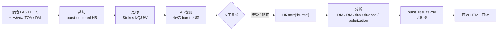

<h1 align="center">AFTER</h1>

<div align="center">

**AI-assisted FAST Transient End-to-end Reduction**

从已确认 burst TOA 到可复核的 FAST FRB 定标测量

[](https://github.com/SukiYume/AFTER)
[](https://github.com/SukiYume/AFTER/stargazers)
[](https://www.python.org/)
[](LICENSE)
[](skills/fast-frb-observation-processing)
[](https://github.com/SukiYume/DRAFTS)

[项目概览](#项目概览) ·
[处理流程](#after-处理流程) ·
[安装](#安装) ·
[快速开始](#快速开始) ·
[数据契约](#数据契约) ·
[Codex Skill](#codex-skill) ·
[English](README.md)

</div>

---

## 项目概览

**AFTER** 是一套 **AI-assisted FAST Transient End-to-end Reduction**
工作流，负责 FAST 快速射电暴（FRB）的搜索后处理。上游搜索程序或观测者提供已确认的
候选 TOA 和基本观测信息后，AFTER 将其转换为定标 H5、经过复核的 burst 区域、
物理量测量、诊断图、结果表，以及可选的 HTML 观测面板。

AFTER 覆盖候选发现之后的完整科学处理链：

1. 从原始 FAST FITS 中裁切以 burst 为中心的数据；
2. 完成流量和偏振定标，生成 Stokes I/Q/U/V；
3. 使用 AI 模型提出 burst 区域；
4. 由用户检查、接受或修正自动标记；
5. 测量 TOA、DM、RM、flux、fluence、width、bandwidth、SNR 和偏振；
6. 导出可复核的表格、诊断图和观测面板。

AFTER 与 [DRAFTS](https://github.com/SukiYume/DRAFTS) 组成连续流程：
DRAFTS 负责找到 transient candidates，AFTER 负责对已确认的 FAST burst 做定标、
测量和出表。

### AFTER 的特点

- **端到端搜索后处理**：从 TOA 列表一直处理到科学结果表；
- **入口灵活**：可以从原始 FITS、未定标 H5、定标 H5 或已标注 H5 开始；
- **FAST 流量与偏振定标**：结合 beam gain 和噪声管定标数据；
- **AI 辅助、人工确认**：自动框必须经过复核后才进入物理量测量；
- **明确的数据契约**：裁切、定标、标注和分析产物都有固定字段约定；
- **批量与交互兼顾**：既能处理大批次观测，也支持逐文件人工修正；
- **Codex skill 支持**：可由 agent 协助安装、自检、分阶段运行和交接复核。

## AFTER 处理流程



AFTER 可以从已有的最早产物继续，不要求每次都从原始 FITS 开始：

| 起点 | 必需输入 | AFTER 后续动作 |
|---|---|---|
| 原始 FAST FITS | FITS 目录、源名、日期、beam、DM、已确认 TOA 秒数 | 裁切、定标、检测、复核、分析、出表 |
| 未定标 H5 | `.h5`、匹配的 `_0001.fits`、RA/DEC、定标参考 | 定标、检测、复核、分析、出表 |
| 定标 H5 | `*_cal.h5`、检测模型、输出目录 | 检测、复核、分析、出表 |
| 已标注定标 H5 | 带 H5 attr `bursts` 的 `*_cal.h5` | 检查标记、分析、出表、生成面板 |
| 分析结果表 | `burst_results.csv` 和可选诊断图目录 | 生成或刷新观测面板 |

### 两条科学处理底线

1. **AFTER 不从文件名或 quick-look 图猜测 TOA。** TOA 秒数必须由观测者或上游搜索
   产品提供。
2. **自动框只是建议，不是最终测量区域。** 进入能量和偏振分析前必须检查接受的
   burst 区域。

## 仓库结构

| 路径 | 在 AFTER 中的职责 |
|---|---|
| [`cut_burst_data.py`](cut_burst_data.py) | 根据 TOA、DM 和 beam 从原始 FAST FITS 裁切 burst-centered H5。 |
| [`calibration.py`](calibration.py) | 流量/偏振定标、下采样、RFI mask 和定标 H5 输出。 |
| [`calibration_noise.py`](calibration_noise.py) | 噪声管定标辅助函数和相关计算。 |
| [`burst_detect.py`](burst_detect.py) | 自动、半自动或手工标记 burst 区域，写入 H5 `attrs["bursts"]`。 |
| [`burst_analysis.py`](burst_analysis.py) | 测量 DM、RM、偏振、flux、fluence、width、bandwidth 和 SNR。 |
| [`burst_dashboard.py`](burst_dashboard.py) | 从 `burst_results.csv` 生成自包含 HTML 观测面板。 |
| [`burst_dm.py`](burst_dm.py) | analysis 使用的精细 DM 搜索模块。 |
| [`burst_pol.py`](burst_pol.py) | RM、PA、PAV 和偏振处理模块。 |
| [`burst_properties.py`](burst_properties.py) | flux、fluence、width、bandwidth 和 SNR 测量模块。 |
| [`rfi_utils.py`](rfi_utils.py) | calibration 与 analysis 共用的 RFI 标记工具。 |
| [`ZeithAngle.py`](ZeithAngle.py) | FAST 天顶角与 beam gain 辅助函数。 |
| [`gain_para.csv`](gain_para.csv) | FAST beam gain 参数。 |
| [`highcal_20201014_psr_tny.npz`](highcal_20201014_psr_tny.npz) | 默认噪声管定标参考。 |
| [`models/`](models/) | 当前生产 burst-region detector 与本地实验权重。 |
| [`batch_processing/`](batch_processing/) | 批量裁切、长周期候选裁切、旧 FITS 转换和批量定标。 |
| [`skills/fast-frb-observation-processing/`](skills/fast-frb-observation-processing/) | Codex 使用 AFTER 的操作协议。 |
| [`requirements.txt`](requirements.txt) | Python 依赖清单。 |

## 安装

Linux/macOS：

```bash
git clone https://github.com/SukiYume/AFTER.git
cd AFTER
python -m venv .venv
source .venv/bin/activate
python -m pip install -U pip
python -m pip install -r requirements.txt
```

Windows PowerShell：

```powershell
git clone https://github.com/SukiYume/AFTER.git
cd AFTER
python -m venv .venv
.\.venv\Scripts\Activate.ps1
python -m pip install -U pip
python -m pip install -r requirements.txt
```

需要 GPU detection 时，应根据目标机器的 CUDA 驱动安装匹配的 `torch` 和
`torchvision`。正式批处理建议随结果记录 Python、CUDA、PyTorch、torchvision 和
ultralytics 的实际版本。

核心依赖包括 NumPy、SciPy、h5py、Astropy、Matplotlib、pandas、Seaborn、Numba、
OpenCV、PyTorch、torchvision 和 Ultralytics。

### 安装后自检

```bash
python -m compileall -q .
python batch_processing/batch_cut_burst_data.py --help
python batch_processing/batch_calibration.py --help
python burst_detect.py --help
python burst_analysis.py --help
python burst_dashboard.py --help
python -m pytest -q
```

## 快速开始

下面的命令只使用通用路径。请把 `/path/to/...` 替换为自己的工作站或计算节点路径。

### 1. 裁切原始 FAST FITS

批量入口：

```bash
python batch_processing/batch_cut_burst_data.py \
  --burst-txt /path/to/catalogs/FRBXXXX_Burst.txt \
  --output-root /path/to/after_runs/cut/FRBXXXX \
  --save-frb-name FRBXXXX \
  --segment-length 65536 \
  --workers 8
```

`FRBXXXX_Burst.txt` 格式：

```text
base project name date beam dm time
```

脚本按原始数据路径、日期、beam 和 DM 分组，复制定标所需的第一个匹配 beam FITS，
逐个裁切已提供的 TOA，并写出 `obs_info.json`。

带逐行 segment length 的长周期候选：

```bash
python batch_processing/batch_cut_selected_long_period.py \
  --plan-txt /path/to/catalogs/Selected_LongPeriod_Burst.txt \
  --output-root /path/to/after_runs/long_period_cut \
  --workers 8
```

### 2. 转换旧版 burst FITS

旧 burst cut 需要转为当前 H5 schema 时：

```bash
python batch_processing/fits_to_h5.py \
  --asd-root /path/to/legacy_burst_data \
  --output-root /path/to/after_runs/cut \
  --catalog-dir /path/to/catalogs
```

脚本会复制匹配的 `_0001.fits` 定标文件，并写出与 `cut_burst_data.py` 兼容的 H5。

### 3. 定标

```bash
python batch_processing/batch_calibration.py \
  --root-dir /path/to/after_runs/cut \
  --cal-root /path/to/after_runs/calibrated \
  --dm-file /path/to/catalogs/h5_calibration_dm_file.txt \
  --cal-npz highcal_20201014_psr_tny.npz \
  --workers 8
```

定标目录表格式：

```text
FRB_name DM RA DEC
```

常用保存分辨率：

- 不传 `--down-time` 和 `--down-freq`：自动选择适合画图的分辨率；
- `--down-time 1`：保留原始时间分辨率，用于 peak-flux 对比；
- `--down-freq 1`：保留原始频率通道，用于频谱和 RFI 细查。

### 4. 检测并复核 burst 区域

自动模式：

```bash
python burst_detect.py \
  --mode auto \
  --cal-dir /path/to/after_runs/calibrated \
  --model-path models/best_model_yolo11n_ema.pth \
  --model-name yolo11n \
  --output-dir /path/to/after_runs/detections
```

检测阶段写出：

- H5 `attrs["bursts"]`：analysis 使用的标记来源；
- `detections.json`：续跑与复核记录；
- `plots/*_det.png`：带已接受区域的复核图。

自动和半自动模式直接使用定标后的 Stokes I 推理一次。确认 burst 框后，AFTER 使用
非 burst 样本按 analysis 相同的 Stokes-I/V 并集方法重算 RFI，写入
`burst_rfi_*`，并保存最终 masked residual 图。

置信度过滤后，`--max-horizontal-aspect` 会移除过宽的横向框（默认 `3`）；存在正面积
重叠的多个框会在 NMS 前只保留面积最大的区域。

自动标记需要修正时使用 `--mode semi-auto`；模型建议明显无用时使用
`--mode manual`。交互界面中，`x` 会记录明确的空 burst 列表；`q` 或 `Esc` 会保存
已完成进度并退出，不会把当前文件误标为完成。

### 5. 分析物理量

```bash
python burst_analysis.py \
  --cal-dir /path/to/after_runs/calibrated \
  --output-dir /path/to/after_runs/analysis \
  --dm-range 5 \
  --dm-step 0.1 \
  --rm-min -1000 \
  --rm-max 1000 \
  --n-rm 100000
```

测量内容包括 TOA、peak flux、fluence、width、burst bandwidth、SNR、DM、RM、线偏振、
圆偏振、总偏振、PA 和 PAV。使用不同 DM/RM 范围重跑时，应写入独立输出目录。

主要输出：

```text
burst_results.csv
DM / RM / polarization 诊断图
```

### 6. 生成观测面板

```bash
python burst_dashboard.py \
  --csv /path/to/after_runs/analysis/burst_results.csv \
  --output /path/to/after_runs/analysis/burst_dashboard.html \
  --analysis-dir /path/to/after_runs/analysis \
  --source FRBNAME \
  --date YYYYMMDD \
  --reference-dm 539 \
  --rm-significance-threshold 5 \
  --top-n 10
```

生成结果是可以本地打开、也可以打印为 PDF 的自包含 HTML。

## 数据契约

### 未定标 H5

```text
data: (nsamp, npol, nchan)
freq: (nchan,), MHz
attrs: start_sample, file_mjd, toa_sec, time_reso, npol, nchan,
       segment_length, obs_start_mjd, dm
```

### 定标 H5

```text
data:        (4, nsamp, nchan), Stokes I/Q/U/V, Jy
freq:        (nchan,), MHz
rfi_mask:    (nsamp, nchan), bool
rfi_channel: (nchan,), bool
gain:        (nchan,), K/Jy
gain_err:    (nchan,), K/Jy
attrs: time_reso_raw, time_reso, down_time, down_freq,
       dm, beam, ra, dec
```

### 已接受 burst 区域

```json
{
  "time_start": 120,
  "time_end": 180,
  "freq_start": 40,
  "freq_end": 500,
  "confidence": 0.82
}
```

明确判定为无 burst 的页面使用空列表记录，而不是缺失复核状态。

## Codex Skill

AFTER 自带 Codex skill：

```text
skills/fast-frb-observation-processing/
```

可以直接让 Codex 执行：

```text
请安装当前 AFTER 仓库中的 Codex skill，把 DATA_PROCESSING_ROOT 设置为
仓库根目录，并完成安装后的自检。
```

Bash 手动安装：

```bash
mkdir -p "${CODEX_HOME:-$HOME/.codex}/skills"
cp -R skills/fast-frb-observation-processing \
  "${CODEX_HOME:-$HOME/.codex}/skills/"
export DATA_PROCESSING_ROOT="$(pwd)"
```

Windows PowerShell：

```powershell
$codexRoot = if ($env:CODEX_HOME) {
    $env:CODEX_HOME
} else {
    Join-Path $HOME ".codex"
}
New-Item -ItemType Directory -Force (Join-Path $codexRoot "skills") | Out-Null
Copy-Item -Recurse -Force `
  .\skills\fast-frb-observation-processing `
  (Join-Path $codexRoot "skills")
$env:DATA_PROCESSING_ROOT = (Get-Location).Path
```

如果后续任务也要让 agent 自动定位 AFTER，应把 `DATA_PROCESSING_ROOT` 持久化到 shell
profile 或系统环境变量。

## 模型与运行结果

AFTER 默认使用 `models/best_model_yolo11n_ema.pth` 进行 burst 检测。比较或更新
detector 时，可以通过 `--model-path` 指定其他兼容 checkpoint。

一次完整运行可以产生：

- 裁切和定标后的 H5；
- `detections.json` 和 burst 复核图；
- `burst_results.csv` 与 DM/RM/偏振诊断图；
- 自包含的 `burst_dashboard.html`。

每个观测或参数重跑都应使用独立输出目录，避免重新标注、DM/RM 扫描或刷新面板时
无意覆盖旧结果。

## 许可

AFTER 采用 [MIT License](LICENSE)。

## DRAFTS 与 AFTER

```text
DRAFTS：暂现源搜索与候选筛选
    -> 已确认 source / date / beam / TOA / DM
AFTER：裁切、定标、复核、测量和出表
```

需要从观测数据中寻找候选时使用
[DRAFTS](https://github.com/SukiYume/DRAFTS)；候选列表已经确定、目标是做 FAST
定标和物理量分析时使用 AFTER。

---

<div align="center">
  <sub>AFTER · From confirmed FAST transients to calibrated measurements</sub>
</div>
