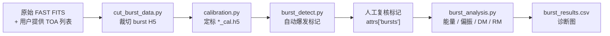

<h1 align="center">AFTER</h1>

<div align="center">

**AI-assisted FAST Transient End-to-end Reduction**

面向 FAST FRB burst 的搜索后处理流程：从 TOA 列表到定标测量、诊断图和结果表。

[](https://github.com/SukiYume/AFTER)
[](https://www.python.org/)
[](skills/fast-frb-observation-processing)
[](https://github.com/SukiYume/DRAFTS)

[概览](#概览) |
[流程](#流程) |
[安装](#安装) |
[Codex Skill](#codex-skill) |
[处理阶段](#处理阶段) |
[English](README.md)

</div>

## 概览

**AFTER** 是一套面向 FAST fast radio burst (FRB) 观测的搜索后处理流程。上游搜索流程或用户提供候选源、观测日期、beam、DM 和 burst TOA 秒数后，AFTER 负责完成裁切、定标、爆发区域复核、能量和偏振分析，以及结果表导出。

AFTER 与 [DRAFTS](https://github.com/SukiYume/DRAFTS) 形成连续工作流：DRAFTS 等搜索 pipeline 负责定位 transient candidates，AFTER 负责对已确认的 FAST FRB burst 做定标、测量和出表。

## 亮点

- **TOA 引导裁切**：从原始 FAST FITS 生成 burst-centered H5。
- **偏振和流量定标**：输出 Stokes I/Q/U/V 形式的定标数据。
- **AI 辅助爆发标记**：自动标记后进入人工复核，再进入物理量测量。
- **能量和偏振分析**：测量 TOA、flux、fluence、width、bandwidth、SNR、DM、RM、偏振比例、PA 和 PAV。
- **灵活入口**：支持从原始 FITS、未定标 H5、定标 H5 或已有 burst 标记的 H5 开始。
- **Codex skill 支持**：支持 agent 完成安装、自检、分阶段处理、复核交接和最终报告。

## 流程



完整流程：

```text
切数据 -> 定标 -> 爆发探测 -> 人工检查标记 -> 能量/偏振分析 -> 出表
```

AFTER 支持从已有中间产物继续处理：

| 起点 | 必需输入 | AFTER 后续动作 |
|---|---|---|
| 原始 FAST FITS | 原始 FITS 目录、源名、日期、beam、DM、用户提供的 TOA 秒数列表 | 切数据、定标、爆发探测、人工检查标记、能量/偏振分析、出表 |
| 未定标 H5 | `cut_burst_data.py` 输出的 `.h5` 和同日期 `_0001.fits` | 定标、爆发探测、人工检查标记、能量/偏振分析、出表 |
| 定标后 H5 | `*_cal.h5`，以及 `data`、`freq`、`rfi_mask`、`gain`、`gain_err` 等字段 | 爆发探测、人工检查标记、能量/偏振分析、出表 |
| 已有 burst 标记的定标 H5 | `*_cal.h5` 且 H5 attrs 中已有 `bursts` | 验证标记、能量/偏振分析、出表 |

TOA 秒数由用户或上游搜索产品提供。自动探测框经过人工检查后进入能量和偏振分析，最终结果使用已确认的 burst 区域。

## 仓库结构

| 路径 | 作用 |
|---|---|
| `cut_burst_data.py` | 根据 TOA、DM 和 beam 从原始 FAST FITS 裁切 burst-centered H5。 |
| `calibration.py` | 把未定标 H5 转换为带 RFI mask 的 Stokes I/Q/U/V 定标数据。 |
| `burst_detect.py` | 支持自动、半自动和手工 burst-region 标记，并写入 H5 `attrs["bursts"]`。 |
| `burst_analysis.py` | 对已确认 burst 测量 DM、RM、偏振、flux、fluence、width、bandwidth 和 SNR。 |
| `burst_dm.py` | `burst_analysis.py` 使用的精细 DM 搜索模块。 |
| `burst_pol.py` | `burst_analysis.py` 使用的 RM、PA、PAV 和偏振处理模块。 |
| `burst_properties.py` | flux、fluence、width、bandwidth 和 SNR 测量模块。 |
| `rfi_utils.py` | calibration 和 analysis 共用的 RFI 通道/像素标记工具。 |
| `ZeithAngle.py` | 根据 MJD、坐标和 beam 计算 FAST ZA 与 gain。 |
| `gain_para.csv` | FAST beam gain 参数表。 |
| `highcal_20201014_psr_tny.npz` | 默认噪声管定标参考文件。 |
| `models/` | burst-region 检测模型权重。 |
| `batch_processing/` | 批量裁切、旧 FITS 转 H5 和批量定标包装脚本。 |
| `skills/fast-frb-observation-processing/` | Codex agent 使用 AFTER 的操作协议。 |
| `requirements.txt` | Python 依赖清单。 |

## 安装

在仓库根目录创建 Python 环境：

```bash
git clone https://github.com/SukiYume/AFTER.git
cd AFTER
python -m venv .venv
source .venv/bin/activate
python -m pip install -U pip
python -m pip install -r requirements.txt
```

Windows PowerShell：

```powershell
git clone https://github.com/SukiYume/AFTER.git
cd AFTER
python -m venv .venv
.\.venv\Scripts\Activate.ps1
python -m pip install -U pip
python -m pip install -r requirements.txt
```

GPU 推理环境请根据本机 CUDA 和驱动版本选择匹配的 `torch` / `torchvision` 安装命令。正式批处理建议记录实际 Python、CUDA、PyTorch 和 ultralytics 版本。

核心依赖包括 `numpy`、`scipy`、`h5py`、`astropy`、`matplotlib`、`pandas`、`seaborn`、`numba`、`opencv-python`、`torch`、`torchvision` 和 `ultralytics`。

## Codex Skill

AFTER 自带 Codex skill：

```text
skills/fast-frb-observation-processing/
```

可以直接让 Codex agent 安装：

```text
请帮我安装本仓库的 Codex skill：复制 skills/fast-frb-observation-processing 到 Codex skills 目录，设置 DATA_PROCESSING_ROOT 为当前 AFTER 仓库根目录，并完成安装后自检。
```

手动安装：

```bash
mkdir -p "${CODEX_HOME:-$HOME/.codex}/skills"
cp -R skills/fast-frb-observation-processing "${CODEX_HOME:-$HOME/.codex}/skills/"
export DATA_PROCESSING_ROOT="$(pwd)"
```

Windows PowerShell：

```powershell
$codexHome = if ($env:CODEX_HOME) { $env:CODEX_HOME } else { Join-Path $HOME ".codex" }
New-Item -ItemType Directory -Force (Join-Path $codexHome "skills") | Out-Null
Copy-Item -Recurse -Force .\skills\fast-frb-observation-processing (Join-Path $codexHome "skills")
$env:DATA_PROCESSING_ROOT = (Get-Location).Path
```

长期使用时，把 `DATA_PROCESSING_ROOT` 写入 shell profile 或系统环境变量。

## 自检

安装依赖后，在仓库根目录运行：

```bash
python -m py_compile cut_burst_data.py calibration.py burst_detect.py burst_analysis.py burst_dm.py burst_pol.py burst_properties.py rfi_utils.py ZeithAngle.py batch_processing/batch_calibration.py batch_processing/batch_cut_burst_data.py batch_processing/batch_cut_selected_long_period.py batch_processing/fits_to_h5.py
python -c "import numpy, scipy, h5py, astropy, matplotlib, pandas, seaborn, numba, torch, torchvision, ultralytics, cv2; print('basic imports OK')"
python burst_detect.py --help
python burst_analysis.py --help
```

如果本机有 Codex skill authoring validator：

```bash
python /path/to/quick_validate.py skills/fast-frb-observation-processing
```

## 处理阶段

### 1. 切原始 FITS

`cut_burst_data.py` 使用原始 FAST FITS 目录、源名、观测日期、beam、DM 和用户提供的 TOA 秒数，生成 burst-centered H5。

主要输出：

```text
{frb}-{date}-M{beam:02d}-{fits_number:04d}-{start_sample:09d}.h5
obs_info.json
```

未定标 H5 schema：

```text
data: (nsamp, npol, nchan)
freq: (nchan,), MHz
attrs: start_sample, file_mjd, toa_sec, time_reso, npol, nchan,
       segment_length, obs_start_mjd, dm
```

### 2. 定标

`calibration.py` 把未定标 H5 转换为 Stokes I/Q/U/V 定标数据。它使用匹配的 `_0001.fits`、RA/DEC、beam、FAST gain 参数和噪声管定标文件。

主要输出：

```text
*_cal.h5
quick-look .jpg
```

定标后 H5 schema：

```text
data:        (4, nsamp, nchan), Stokes I/Q/U/V, Jy
freq:        (nchan,), MHz
rfi_mask:    (nsamp, nchan), bool
rfi_channel: (nchan,), bool
gain:        (nchan,), K/Jy
gain_err:    (nchan,), K/Jy
```

常用保存分辨率：

- `down_time=None`、`down_freq=None`：自动选择适合画图和检测的分辨率。
- `down_time=1`：保留原始时间分辨率，用于 peak flux 对比。
- `down_freq=1`：保留原始频率通道，用于细致 RFI 或频谱检查。

### 3. 爆发探测和人工复核

`burst_detect.py` 支持自动、半自动和手工 burst-region 标记。

自动模式：

```bash
python burst_detect.py \
  --mode auto \
  --cal-dir /path/to/calibrated_h5 \
  --model-path models/best_model_yolo11n_ema.pth \
  --model-name yolo11n \
  --output-dir /path/to/detections_auto
```

检测输出：

- H5 `attrs["bursts"]`：analysis 读取的标记来源。
- `detections.json`：续跑和复核记录。
- `plots/*_det.png`：带确认框的复核图。

复核阶段检查自动标记、记录需要修正的文件，并通过半自动或手工模式写入修正后的 region。需要显式剔除某页时，写入：

```json
{"bursts": [], "has_burst": false}
```

### 4. 分析和出表

`burst_analysis.py` 读取已确认的 H5 `attrs["bursts"]`，逐个 burst 计算物理量。

示例：

```bash
python burst_analysis.py \
  --cal-dir /path/to/calibrated_h5 \
  --output-dir /path/to/analysis_output \
  --dm-range 5 \
  --dm-step 0.1 \
  --rm-min -1000 \
  --rm-max 1000 \
  --n-rm 100000
```

测量内容包括 TOA、peak flux、fluence、width、burst bandwidth、SNR、DM、RM、线偏振、圆偏振、总偏振、PA 和 PAV。

主要输出：

```text
burst_results.csv
DM/RM/polarization diagnostic plots
```

## 批量输入表

批量包装脚本通过命令行显式接收输入表。本地观测清单通常放在 `batch_processing/*.txt`，git 默认忽略这些本地清单；公开模板可以使用 `*.example.txt`。

`FRB*_Burst.txt`：

```text
base project name date beam dm time
```

`h5_calibration_dm_file.txt`：

```text
FRB_name DM RA DEC
```

## 输出管理

AFTER 默认把运行产物保留在版本控制之外：

- H5/FITS 数据：`*.h5`、`*.fits`、`*_cal.h5`
- 诊断图：`*.jpg`、`*.png`
- 检测和分析输出：`detections/`、`analysis_output/`、`analysis_outputs/`
- 本地批量输入表：`batch_processing/*.txt`
- 本地旧模型权重：`models/*.old`

## 相关项目

[DRAFTS](https://github.com/SukiYume/DRAFTS) 是 deep learning-based radio fast transient search pipeline。AFTER 接续搜索后的科学工作流，对已确认的 FAST FRB burst 进行定标、测量和出表。

---

<div align="center">
  <sub>AFTER 把已确认的 FAST FRB candidate 转换为可复核的定标测量和结果表。</sub>
</div>
